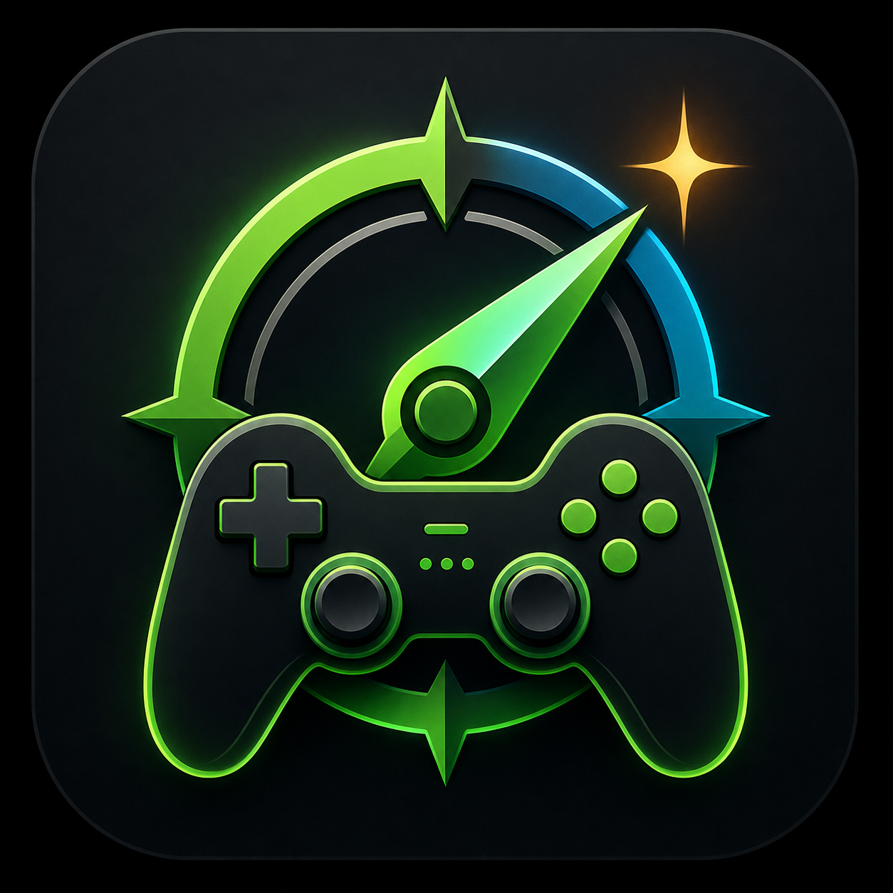

# Proton Pilot

<p align="center">
  
</p>

<p align="center">
  <strong>Per-game Steam/Proton launch profile manager for Linux gaming.</strong>
</p>

Version: 0.10.1

Proton Pilot is a local GUI for managing Steam launch options per installed game.
It is designed for Linux gaming setups using Steam, Proton, GE-Proton, Gamescope,
GameMode, MangoHud, HDR, VKD3D-Proton, and experimental options such as FSR4 upgrade.

## Descripcion En Castellano

**Proton Pilot** es una aplicacion grafica para gestionar opciones de lanzamiento
de Steam por juego en Linux. Detecta tus juegos instalados, tu GPU, tu sesion
grafica y herramientas como Gamescope, GameMode y MangoHud, y te propone perfiles
practicos para rendimiento, HDR, Ray Tracing, FSR4, Wayland y handhelds como
Lenovo Legion Go 2 con Bazzite o SteamOS.

La app no instala Steam ni modifica configuraciones globales del sistema. Solo
edita las opciones de lanzamiento por juego y crea copias de seguridad antes de
tocar `localconfig.vdf`.

## What It Does

- Detects installed Steam games from local app manifests.
- Lets you add a Steam game manually by name and AppID when local detection misses it.
- Lets you add an external Windows executable as a local Proton Pilot profile and launch it with an installed Proton build.
- Can also add external executable profiles to Steam's non-Steam shortcut library.
- Lets you edit or remove manually added games, with confirmation before removal.
- Extracts external executable icons when `icoutils` is available, so manual
  Proton profiles can look closer to their launcher/menu icon.
- Lets you choose and persist a custom Steam root path if automatic detection misses it.
- Reads and writes Steam launch options in `localconfig.vdf`.
- Shows and changes the Steam compatibility tool / Proton version used by each
  Steam game through `config.vdf` `CompatToolMapping`.
- Recommends one installed Proton tool based on the local system, preferring
  Cachy Proton on CachyOS, newer GE/Cachy/Experimental builds for AMD/HDR/Wayland
  setups, and Steam defaults when nothing special is needed.
- Creates a backup before writing changes.
- Shows system-aware recommendations based on detected GPU, session type, and installed tools.
- Shows clear system status cards for display resolution, HDR, VRR, GPU, tools,
  and Gaming Mode/Desktop Mode.
- Provides a compact mode for smaller screens and a read-only mode for safe
  inspection without writing launch options or presets.
- Detects Bazzite, SteamOS-style sessions, Lenovo Legion Go devices, and handheld-friendly setups.
- Detects the primary monitor resolution and can force Gamescope to expose the real physical resolution to the game.
- Provides built-in per-game presets and user-created shared presets stored in a JSON config file.
- Provides an automatic shared `Recomendado del sistema` preset based on detected hardware and session.
- Lets you create, load, update, and delete your own shared presets.
- Lets you save a manually edited final command as a per-game custom preset.
- Shows when the prepared command differs from the command currently saved for
  the selected game.
- Provides a compare view for saved vs prepared launch options.
- Shows a pre-apply diagnostic for Steam state, tools, HDR, VRR, Gamescope
  resolution, and risky option mismatches.
- Includes a dedicated HDR/VRR diagnostic explaining what KDE/Gamescope reports
  and what may be missing.
- Keeps a small per-game launch-option history so previous commands can be
  restored.
- Keeps a small per-game Proton-version history so previous compatibility-tool
  choices can be restored when the old Proton build is still installed.
- Includes a profile assistant for common goals such as performance, HDR, VRR
  stability, Ray Tracing/DX12, handheld battery, and minimal safe setup.
- Shows ProtonDB official summary data, colored ratings, and community launch hints when available.
- Shows ProtonDB cache age and can refresh ProtonDB data from the recommendation dialog.
- Opens the selected game's ProtonDB page.
- Can apply Unreal Engine HDR config tweaks for games that need them.
- Can register the generated AppImage as a Steam non-Steam shortcut.
- Can check the latest GitHub release and open the AppImage download page.

## Install

Clone the repository and run:

```bash
./install.sh
```

The installer can install missing dependencies on supported distributions. It
will ask before using `sudo` or `rpm-ostree`.

Automatic dependency install:

```bash
./install.sh --deps
```

Skip dependency installation:

```bash
./install.sh --no-deps
```

The installer copies the app to:

```bash
~/.local/share/proton-pilot
```

and creates:

```bash
~/.local/bin/proton-pilot
~/.local/share/applications/proton-pilot.desktop
```

Run it from the application menu as **Proton Pilot**, or from a terminal:

```bash
proton-pilot
```

## AppImage

The project also includes an AppImage builder:

```bash
./build-appimage.sh
```

It creates:

```bash
dist/Proton-Pilot-<version>-x86_64.AppImage
```

The AppImage bundles Proton Pilot's Python-side dependencies, including PySide6
and `vdf`. System integrations are still expected from the host: Steam,
Gamescope, GameMode, MangoHud, `icoutils`, and GPU/display drivers are not
bundled because they must match the local Linux gaming stack.

Most desktops need FUSE support to run AppImages directly. On Arch/CachyOS this
is usually:

```bash
sudo pacman -S fuse2
```

## Requirements

- Python 3
- PySide6 for the full GUI
- `python-vdf` / `python3-vdf` for Steam non-Steam shortcut editing
- Steam installed locally

Optional tools detected and used by presets:

- `gamescope`
- `gamemoderun`
- `mangohud`
- `xdg-open`
- `icoutils` (`wrestool` and `icotool`) for extracting icons from external
  Windows executables

The installer supports dependency installation through:

- `pacman` for Arch/CachyOS
- `dnf` for Fedora
- `rpm-ostree` for Bazzite/Fedora Atomic
- `apt` for Debian/Ubuntu-based systems
- `zypper` for openSUSE

On Arch/CachyOS:

```bash
sudo pacman -S python-pyside6 python-vdf icoutils gamescope gamemode mangohud
```

On Bazzite / Fedora Atomic-style systems, first check whether PySide6 is already
available:

```bash
python3 -c "import PySide6"
```

If it is missing, install it through your OS-supported package flow. On many
Fedora-based immutable systems this is:

```bash
rpm-ostree install python3-pyside6
systemctl reboot
```

SteamOS/Bazzite Gaming Mode normally already handles display modes, TDP, frame
limits, and overlays at the session level. Proton Pilot only edits per-game
Steam launch options.

## Legion Go 2 / Bazzite / SteamOS Compatibility

Proton Pilot includes handheld-aware detection and presets for devices
like the Lenovo Legion Go 2 running Bazzite or SteamOS-style environments.

The Legion Go 2 class display is commonly reported as an 8.8-inch OLED 16:10
panel at 1920x1200 with up to 144 Hz and VRR. Proton Pilot therefore adds:

- `Handheld bateria: 800p / 60 FPS`
- `Handheld equilibrado: 800p / 72 FPS`
- `Legion Go 2 nativo: 1200p / 72 FPS`
- `Legion Go 2 OLED HDR`
- `Legion Go 2 FSR4 + Wayland`

The 800p profiles use:

```bash
gamescope -f -w 1280 -h 800
```

The native profile uses:

```bash
gamescope -f -w 1920 -h 1200
```

The app recommends handheld profiles when it detects Bazzite, SteamOS,
Gamescope sessions, or Lenovo Legion Go hardware. It does not modify BIOS,
TDP, fan curves, controller firmware, or system-level handheld services.

HDR on handheld Linux setups is still game, compositor, display, and OS-version
dependent. The HDR preset enables the launch path, but you may still need HDR
enabled in the OS/session and in the game.

## Gaming Mode Status And Roadmap

Current support target:

- Configure games from Desktop Mode.
- Save Steam launch options, Proton version, presets, HDR/VRR/Gamescope settings,
  and diagnostics from Proton Pilot.
- Return to Steam Gaming Mode and launch the game from Steam.

This is the recommended flow for Bazzite/SteamOS handhelds because Steam Gaming
Mode is a minimal Steam session intended for controller-first game launching.
Proton Pilot's current Qt interface is a desktop GUI, so it is not yet considered
fully controller-native inside Gaming Mode.

Possible today, but not officially polished:

- Add the AppImage as a non-Steam app and launch Proton Pilot from Gaming Mode.
- Use touch/mouse/keyboard to change settings.

Known limitations for running the app itself inside Gaming Mode:

- Controller navigation is not designed yet.
- Qt file pickers and confirmation dialogs may be awkward inside Gamescope.
- Closing/reopening Steam from inside the Steam Gaming Mode session is risky and
  should be avoided.
- The UI is still denser than a handheld-first flow should be.

Implemented safety for Gaming Mode:

- Proton Pilot detects likely Gaming Mode sessions.
- It avoids automatic Steam shutdown when Gaming Mode is detected.
- It includes read-only mode and an AppImage registration button.

## Planned Handheld Mode

The current handheld support is profile-oriented: Proton Pilot detects handheld
setups, provides handheld presets, marks safer options, and avoids risky Steam
shutdown behavior in Gaming Mode. A true handheld mode is planned as a second UI
on top of the existing logic, not as a rewrite of the app.

Target behavior:

- Start with `proton-pilot --handheld`.
- Auto-open this view when a likely Steam Gaming Mode session is detected.
- Use a controller/touch-friendly flow: `Game -> Profile -> Proton -> Review -> Apply`.
- Keep the desktop UI available for advanced editing and diagnostics.

Planned first version:

- Large game list with icons and ProtonDB rating colors.
- Big action buttons and clear focus outlines.
- Profile cards for `Battery`, `Balanced`, `Performance`, `HDR`, `VRR stable`,
  `FSR4 experimental`, and `Safe`.
- Proton selector with the currently applied version and the recommended
  installed version.
- Review screen showing game, selected profile, Proton, resolution, FPS cap,
  HDR/VRR state, and the final command.
- One clear `Apply` action with confirmation.
- Read-only default when launched from Gaming Mode while Steam is running.

Controller/navigation requirements:

- D-pad/arrow navigation between cards and buttons.
- `A`/Enter to confirm.
- `B`/Escape to go back.
- No accidental changes from scroll wheels or hidden focus.
- No required text entry for the basic flow.

Safety requirements:

- Do not automatically close Steam from inside Gaming Mode.
- If Steam-writing changes are unsafe, explain that they should be applied from
  Desktop Mode or after closing Steam manually.
- Avoid Qt file pickers in the handheld flow.
- Keep advanced actions such as custom paths, manual executable selection, and
  raw command editing in the desktop UI.

Test targets before calling it supported:

- Desktop Mode on CachyOS/KDE.
- Bazzite Desktop Mode.
- Bazzite Gaming Mode launched as a non-Steam AppImage.
- Legion Go 2 style 1920x1200 handheld profile.
- Legion Go S / SteamOS-style 800p profile.
- Focus/navigation behavior with keyboard, controller-mapped keyboard events,
  and touch.

## Uninstall

```bash
./uninstall.sh
```

User config is intentionally kept at:

```bash
~/.config/proton-pilot/config.json
```

## Test

```bash
python3 -m unittest discover -s tests
```

## Config File

The app stores its own configuration here:

```bash
~/.config/proton-pilot/config.json
```

If an older config exists at `~/.config/steam-game-options/config.json`, Proton Pilot
copies it on first launch.

## Steam Files Touched

Launch options are written to:

```bash
~/.local/share/Steam/userdata/<account>/config/localconfig.vdf
```

Per-game Proton compatibility-tool choices are written to:

```bash
~/.local/share/Steam/config/config.vdf
```

Backups are created next to that file before saving.

Close Steam before saving launch options when possible. Steam can rewrite
`localconfig.vdf` when it exits.

When Steam is open, the GUI can close Steam, write or clear launch options, and
then try to reopen Steam. If reopening fails, Proton Pilot shows a message asking
you to open Steam manually.

If Proton Pilot detects Steam Gaming Mode, it avoids closing Steam automatically
and asks you to apply Steam-writing changes from Desktop Mode instead.

## Recommendation Colors

- Green: generally recommended default.
- Yellow: recommended based on detected local hardware/session/tools.
- Blue: option already detected in the current Steam launch command.

## Interface Notes

- The game list keeps a compact width and uses a horizontal scrollbar for long names.
- The left game panel is resizable, so wide game names and the right-side controls
  can be balanced manually.
- Steam library icons are shown when they exist in Steam's local cache.
- External executable icons are extracted from the `.exe` when `icoutils` is
  installed; otherwise Proton Pilot falls back to the generic icon.
- Launch options are displayed as a vertical list so each option is easier to scan.
- `Guardar comando manual` is highlighted in green. It is meant for cases where
  you edit the `Comando final` text directly; Proton Pilot will offer to create
  a per-game custom preset for that exact command.
- `Borrar opciones` is highlighted in red and asks for confirmation before clearing
  the saved Steam launch options for the selected game.
- The selected game panel shows the currently saved launch command and whether it
  matches a saved preset.
- Selecting a preset loads its options immediately. `Aplicar preset` is only
  needed when you want to save that selected preset to the game.
- The selected-game panel warns immediately when no preset is applied. Pending
  preset selections are shown inside the preset box, next to the selector and
  `Aplicar preset`.
- The selected-game panel shows the current Proton/compatibility tool and lets
  you switch to Steam default or an installed Proton build.
- The main workspace is split into tabs: summary, presets, launch options, and
  advanced command/resolution controls.
- The summary, actions, preset, Proton, and Gamescope resolution controls wrap
  into multiple rows on narrower screens to avoid clipped content.
- Frequent actions and diagnostic/maintenance tools are separated into different
  groups to reduce visual noise.
- The selected-game panel also warns when the command prepared on screen differs
  from the command already saved for that game.
- `Comparar` shows saved launch options next to the prepared command.
- `Historial` can restore one of the previous commands saved before an overwrite
  or clear operation.
- `Historial Proton` can restore a previously used Proton compatibility tool if
  that Proton version is still installed.
- `Aplicar cambios preparados` writes the command currently visible on screen.
- `Modo compacto` hides technical descriptions and shortens the command summary
  for smaller screens.
- `Solo lectura` lets you inspect games, presets, ProtonDB, diagnostics, and
  commands without writing to Steam or changing presets.
- `Asistente perfil` marks options for a selected goal, then leaves the command
  on screen for review before applying.
- If multiple presets generate the same launch command, Proton Pilot remembers
  the exact preset you applied for that game and selects it again when you
  return to the game.
- Launch options are grouped into collapsible sections: performance, display/HDR,
  handheld scaling, and Proton compatibility.

## External Executables

The `Añadir juego` button supports two paths:

- `Steam AppID`: adds a Steam game manually when local manifest detection misses it.
- `Ejecutable Proton`: selects a Windows `.exe`/`.msi`, chooses an installed Proton
  build or a custom Proton path, and stores a local Proton Pilot profile.

External executable profiles do not write to Steam's `localconfig.vdf`. They are
stored in Proton Pilot's config and launched with:

```bash
STEAM_COMPAT_DATA_PATH=~/.config/proton-pilot/compatdata/<profile> proton run <exe>
```

When adding an external profile, Proton Pilot can optionally add it to Steam's
non-Steam shortcut library by writing `shortcuts.vdf` with a backup. If that
shortcut exists, saving the external profile can also update its Steam launch
options.

## Forcing Real Gamescope Resolution

On KDE Wayland with fractional scaling, a 2560x1440 monitor at 125% scale may
appear to games as a logical 2048x1152 surface. Proton Pilot can now force
Gamescope to expose the real monitor resolution using:

```bash
gamescope -f --force-windows-fullscreen -W 2560 -H 1440 -w 2560 -h 1440 -r 180 -- ...
```

Use the `Resolucion real Gamescope` option and press `Usar monitor principal`.
The app will fill the detected width, height, and refresh rate. It also creates
a per-game preset named `Monitor nativo Gamescope: <resolution>`.

## VRR FPS Cap

Use `VRR cap automatico` with Gamescope/Adaptive Sync to cap FPS just below the
applied refresh rate. Proton Pilot uses `Hz - 3`, so a 180 Hz display becomes:

```bash
MANGOHUD_CONFIG=fps_limit=177,no_display gamescope ... -- mangohud %command%
```

This uses MangoHud's limiter because Gamescope's `--framerate-limit` is rounded
as a divisor of the refresh rate on the tested local version, so `177` on a
180 Hz display can behave like 180.

The cap uses the refresh value currently applied in the Gamescope resolution
section. Press `Aplicar resolucion` or `Usar monitor principal` before saving if
you changed the Hz fields.

## Usability Notes

Preset selectors and Gamescope resolution spin boxes ignore the mouse wheel, so
scrolling through the app will not accidentally change the selected preset or
width/height/Hz fields. New presets created from the GUI are shared by default
and can be loaded for any game.

Yellow launch options are recommended or important for the detected system.
`Marcar recomendadas` enables those detected recommendations in the UI, but it
does not write anything to Steam until you create/update/apply a preset or save a
manual command.
Red launch options are useful but experimental or game-sensitive; Proton Pilot
may still recommend them when the system supports them, but they should be
validated per game.

`Gamescope fullscreen` starts the game inside Gamescope. `Resolucion real
Gamescope` is the mode-setting layer on top of that: it supplies the monitor's
real width, height, and refresh rate with `-W/-H/-w/-h/-r`.

## Important Notes

`PROTON_FSR4_UPGRADE=1` attempts to upgrade compatible FSR 3.1 paths to FSR4 in
Proton builds that support it. It is not universal and depends on the game,
GPU, driver, and Proton build.

`PROTON_ENABLE_WAYLAND=1` forces Wine/Proton's Wayland driver. It can improve
integration on Wayland sessions, but some games may have input, overlay, or
launcher issues.

HDR generally needs Gamescope HDR, a working HDR desktop/display path, and game
support or game-specific configuration.

## Iteration History

- 0.1.0: Initial Zenity launch option tool.
- 0.2.0: Added HDR, GameMode, MangoHud, Gamescope, and custom options.
- 0.3.0: Added ProtonDB actions and per-game presets.
- 0.4.0: Rebuilt as a PySide6 GUI with clearer panels and recommendations.
- 0.5.0: Renamed to Proton Pilot, added custom logo, system-aware recommendations,
  hover descriptions, FSR4/Wayland options, README, and versioning.
- 0.6.0: Added Bazzite/SteamOS/handheld detection, Legion Go 2 presets, 800p/1200p
  Gamescope profiles, frame-limit presets, and handheld documentation.
- 0.6.1: Added dependency installation to `install.sh`, README logo, and Spanish
  project description.
- 0.6.2: Made the main window more compact and scrollable for small screens and
  handheld-style displays.
- 0.7.0: Added real-monitor Gamescope resolution forcing with automatic display
  detection, per-game native monitor presets, and UI fields for width/height/Hz.
- 0.7.1: Improved desktop layout: fixed-width game list, wider startup window,
  no horizontal scroll on the options panel, and two-column option grid.
- 0.7.2: Switched launch options to a vertical list, added Steam cached game
  icons, manual game entries, clearer save/delete buttons, and delete confirmation.
- 0.7.3: Added preset update flow, clearer preset feedback/confirmations, visible
  button frames, and experimental external executable profiles launched through
  detected or manually selected Proton builds.
- 0.7.4: Added configurable Steam root path and safer Steam launch-option writes
  that can close Steam, save/clear options, and reopen Steam automatically.
- 0.7.5: Fixed recommended options being re-selected after reloading a game,
  which could bring back MangoHud/GameMode after saving a preset without them.
- 0.7.6: Fixed preset application using stale stored commands and persisted
  side-effect options such as Unreal HDR tweaks per game.
- 0.7.7: Gamescope resolution fields now affect the command only after pressing
  `Aplicar resolucion` or `Usar monitor principal`, and preset logic has
  regression tests.
- 0.7.8: Added `VRR cap automatico`, which derives a Gamescope FPS cap from the
  applied monitor refresh rate.
- 0.7.9: Changed `VRR cap automatico` to use MangoHud's FPS limiter instead of
  Gamescope's divisor-based limiter.
- 0.8.0: Added shared user presets, disabled accidental mouse-wheel changes on
  preset and resolution controls, enabled launching Steam games from the GUI,
  highlighted key Gamescope options, and added official ProtonDB summary data.
- 0.8.1: Improved system recommendations for Gamescope/HDR, added colored
  ProtonDB ratings in the game list, clarified Gamescope option descriptions,
  and added optional Steam non-Steam shortcut creation for external profiles.
- 0.8.2: Added clearer colored system status cards, explicit HDR/VRR detection,
  ProtonDB rating badges, MangoHud toggle help, and cautious VRR/Adaptive Sync
  recommendations.
- 0.8.3: Added an automatic system-recommended preset, clearer selected-game
  panel, manual game edit/removal, a more prominent start button, cleaner GPU
  names, and removed launch confirmation popups.
- 0.8.4: Fixed initial game-list population so every detected Steam game appears
  in the GUI, not only the last sorted entry.
- 0.8.5: Preset selection now loads options automatically, the current applied
  preset is selected when opening a game, and applying a different preset asks
  for confirmation.
- 0.8.6: Stores the exact applied preset per game and shows a red pending state
  when the selected preset differs from the saved/applied one.
- 0.8.7: Extracts icons for external executables when `icoutils` is available
  and clarifies manual command saving by creating per-game custom presets.
- 0.8.8: Separates the applied-preset warning from the pending selected-preset
  message so the preset selector explains its own state.
- 0.8.9: Adds pending-change status, saved-vs-prepared comparison, pre-apply
  diagnostics, per-game launch history/restore, ProtonDB cache refresh details,
  and a goal-based profile assistant.
- 0.9.0: Adds per-game Proton display/change support, Proton recommendations,
  a tabbed interface to reduce clutter, an AppImage builder alongside the
  existing installer, and documents the future Gaming Mode handheld UI roadmap.
- 0.9.1: Improves responsive layout so Proton, system cards, action buttons,
  presets, and Gamescope resolution controls do not get clipped on narrower
  windows.
- 0.10.0: Adds compact/read-only modes, a resizable game panel, grouped launch
  options, clearer frequent-vs-diagnostic actions, HDR/VRR diagnostics, Proton
  rollback history, Gaming Mode write safety, AppImage Steam registration, and
  GitHub release update checks.
- 0.10.1: Handles GitHub repositories without releases gracefully and increases
  group-box spacing so titles do not overlap the content.
